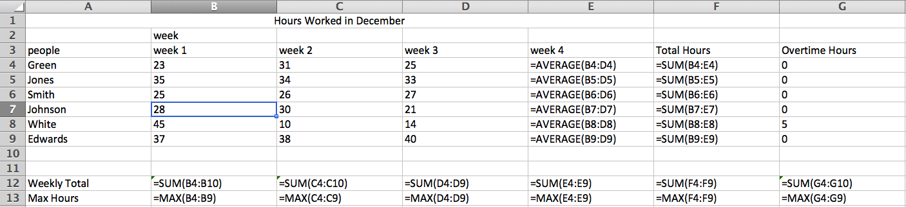

# Spreadsheet error detection with a type system

## 1. Motivation
* Panko, R. (2016). What We Don't Know About Spreadsheet Errors Today: The Facts, Why We Don't Believe Them, and What We Need to Do. arXiv preprint arXiv:1602.02601.

### 1.1 Popular spreadsheet errors
* logical errors (45%): mathematical and domain knowledge
* mechanical errors (23%): pointing to wrong cell and typing errors
* omission errors (31%): leaving out a necessary component

### 1.2 Facts
* 14 laboratories spreadsheet development studies involving 967 individuals working alone on a variety of tasks. These numbers come from the Panko spreadsheet research website. The average across these studies is a cell error rate of 3.9%
* the probability of an error increases rapidly when there are many calculations that depend on precedent cells

## 2. Literature
* Bibtex file
* Survey

## 3. Method description
* Problem Description: Can we detect the mechanical errors, omission errors and part of logical errors in spreadsheet using static analysis, like type system?

### 3.1 Type analysis
#### 3.1.1 Syntax of spreadsheets 
* ``Cell expressions``: e ::= \blank | \error | v | a | ωn(e1, . . . , en) 
* ``Spreadsheet``: s :: (a1, e1) ; . . . ; (am, em) i != j => ai != aj
* note: e is expression, \blank is blank cell, \error is error cell, v is value, a is address, ω is operations, n is the number of parameters required by the operation.
#### 3.1.2 Types
* ``Basic Types``: Dependent Type, AND Type, and OR Type.
* ``Dependent Type``: Cells with value v and header t are in type t[v], e.g. type for cell B3 is week[week1]. It can be recursively defined. e.g. type for cell B7 is week[week1[28]] 
* ``AND Type``: Cells with one more types are in type t1[v]&t2[v], e.g. type for cell B7 is week[week1[28]]&people[Johnson[28]].
* ``OR Type``: Cells with operations referred to other n cells will have a type t1[v]|t2[v]...|tn[v], e.g. type for cell B12 is week[week1[23]]&people[Green[23]] | week[week1[35]]&people[Jones[35]] | ... | week[week1[37]]&people[Edwards[37]].

#### 3.1.3 Judgements
1. Every value that does not have a header is a well-typed.
2. If a cell has value v and header t, then it t[v] is well-typed.
3. For AND Type, if there is no common ancestor, it is well-typed.
4. For OR Type, if there is a common header ancestor, it is well-typed.

<!-- ## 4. Simple example

* By spatial analysis and operational semantics of each formula, we can know the "type" for each cell. 
* For cell B12, by spatial analysis, we know that the type is WeeklyTotal[193] & week[week1[193]]. Since there is no common ancestor of WeeklyTotal[193] and week[week1[193]], with Judgement 3, we know it is well-typed.
* For cell B12, by analyzing the operational semantics, we know that the type is week[week1[23]]&people[Green[23]] | week[week1[35]]&people[Jones[35]] | ... | week[week1[37]]&people[Edwards[37]]. Since there is common anscestor week, thus with Judgement 4, we know it is well-typed.
* If there is a cell with formula "A5 + C4", via analysis, we know it is typed as people[Jones]|week[week2[31]]. Since there is no common ancestor, it is ill-typed and it will be marked as a potential wrong cell. -->

## Give it a try 
! [example revised from corpus](misc/img/test.png)
### Command
* ``python main.py input_file output_file`` (e.g. ``python main.py test.xlsx res.xlsx``)
* ``input_file``: the path to the input file. The file should be .xlsx file.
* ``output_file``: the path to the output file.

### Detection Analysis
#### Problematic cells
* ``B12`` : range error.
```
Type of B12: 0 | (Hours Worked[13] & People[Jones[13]]) | (Hours Worked[15] & People[Smith [15])] | ... | (Hours Worked[44] & People[Stevens[44]])
Judgement: No common ancestor, thus ill-typed.
```
* ``E4`` : refer error.
```
Type of E12: Total Sales[500] & People [Jones[500]] | Hours Worked[15] & People[Smith[15]] & Hourly Pay Rate[7.5] & People[Smith[7.5]] | ...
Judgement: No common ancestor, thus ill-typed.
```
* ``[F6:F11]``: flashfill error.
Similar analysis applied.

#### Detection
! [example revised from corpus](misc/img/correct.png)
* The ill-typed cells are marked in red.
* One of the limitation of this type checker is that it cannot find the root causes.


